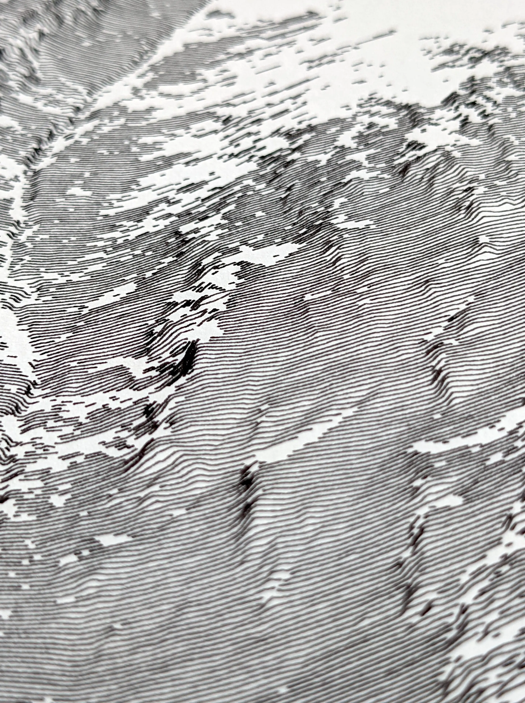
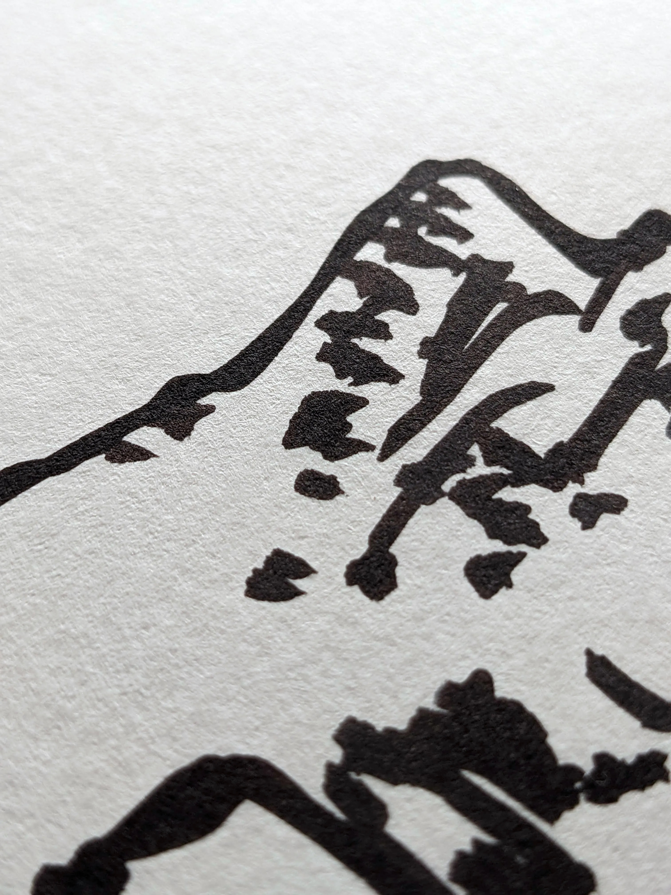
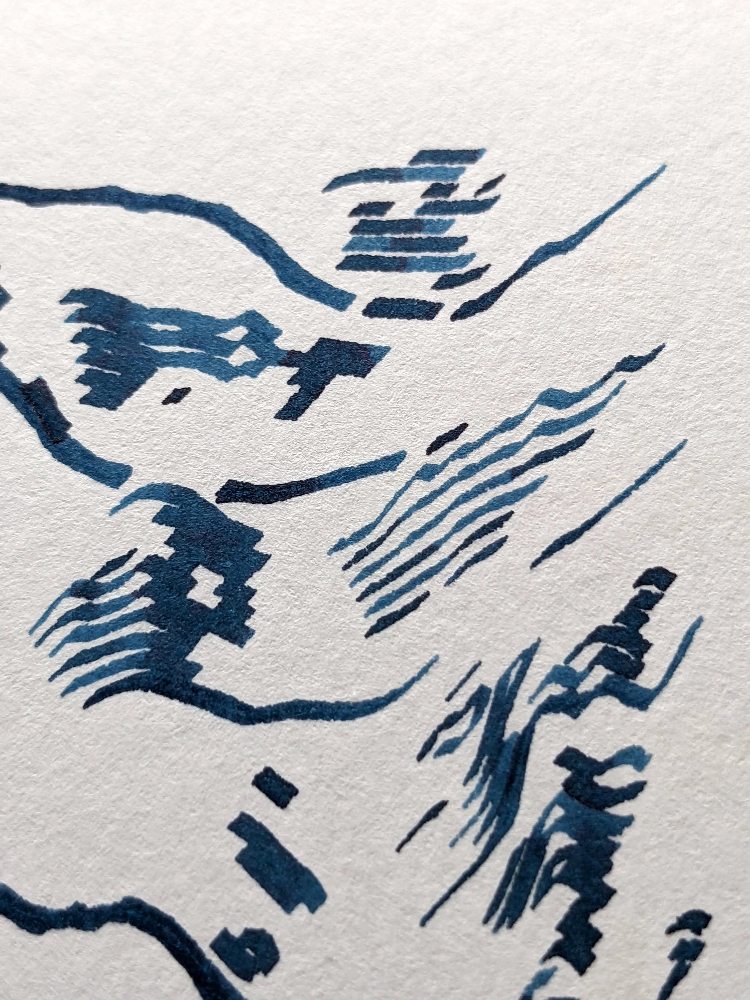

:::{.column-screen .full-screen}

```{=html}
<div id="carousel" class="carousel slide full-carousel" data-bs-ride="false">

  <div class="carousel-inner">
    <div class="carousel-item active">
      
    </div>
    <div class="carousel-item">
      
    </div>
    <div class="carousel-item">
      
    </div>
    <div class="carousel-item">
      
    </div>
  </div>

  <button class="carousel-control-prev" type="button" data-bs-target="#carousel" data-bs-slide="prev">
    <i class="bi bi-caret-left-fill" aria-hidden="true"></i>
    <span class="visually-hidden">Previous</span>
  </button>

  <button class="carousel-control-next" type="button" data-bs-target="#carousel" data-bs-slide="next">
    <i class="bi bi-caret-right-fill" aria-hidden="true"></i>
    <span class="visually-hidden">Next</span>
  </button>

</div>
```

:::


:::{.column-body}

<br> 

::: {style="font-size: 1.1em"}
> Using a programming language, i write algorithms that guide a machine to create drawings from data. Each execution produces a different result, a way to work with circumstances and surprises, whether they come from randomness or coding errors.
:::

## Series 

::: {#list-series}
:::

<br> 

::: {.strip .grid}
::: {}
A digital and mechanical process that turns data into ink on paper.

[works →](posts/works/index.qmd){.strip-link}
:::

::: {.span-2}
A technology to play with aesthetics, and to question the practice itself.

[research →](posts/research/index.qmd){.strip-link}
:::
:::


:::