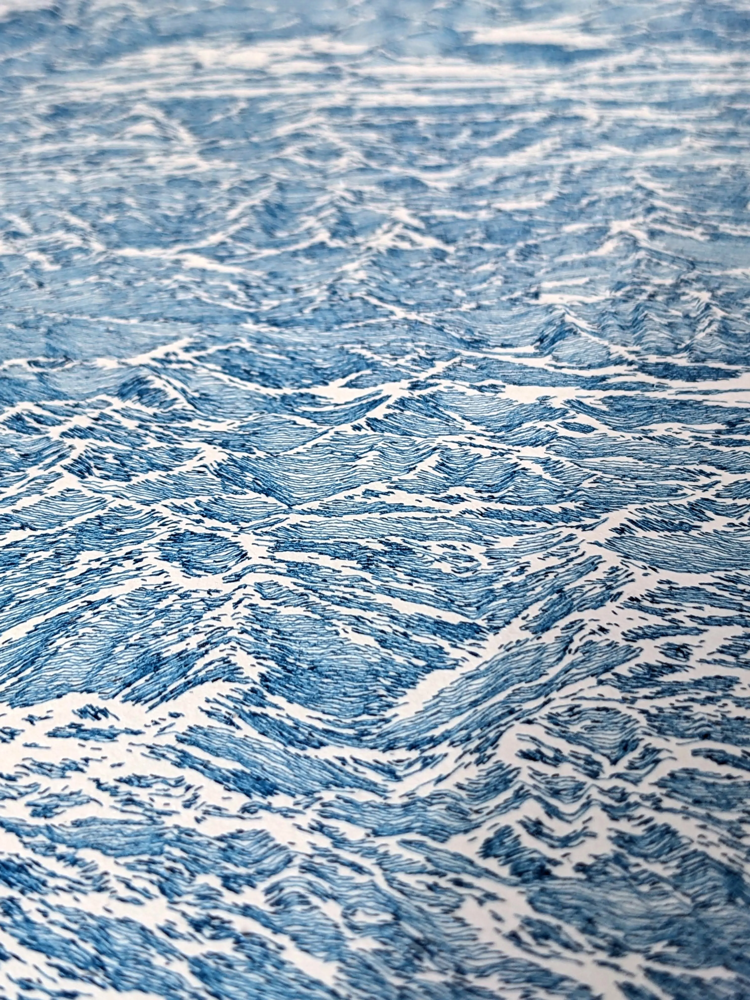

```{r, include=FALSE}
source(here::here("R/0_functions_web.r"))
```

:::{.column-body-outset style="font-size: 100%; margin-bottom: 2cm;"}

::: {.grid}

::: {.g-col-9 .center-container-v style="font-size: 150%;"}
> **Algorithmic art, mainly designed for pen plotters.**
:::

:::

<br> 

::: {.grid}

::: {.g-col-6 .gallery-flow .img-square .img-rounded} 
 {.lightbox group="default"}
:::

::: {.g-col-6 .gallery-flow .two .img-square .img-rounded}
```{r}
#| echo: false
#| results: asis

list_images <- c(
  "20230527_ridges","20230108_brush","20231026_ridges","20220426_ridges")

make_gallery(
  output = "md", full = "posts/works/portfolio/img/gallery", sort = "none",
  pattern = list_images
)

```
:::

:::

<br> 

::: {style="font-size: 120%"}
Using a programming language, i write algorithms that guide a machine to create [drawings](posts/works/portfolio/index.qmd) from data. Each execution produces a different result.  
By transforming data into ink on paper, i'm considering technology as a tool to [investigate](posts/works/statement/index.qmd), to probe questions rather than solve them. Sometimes the algorithm produces exactly what was expected; disappointingly predictable. Other times it generates something surprising, which can become the most interesting starting point for the next iteration. This process is a way to work with circumstances and surprises, whether they come from randomness or coding errors!
:::

<br> 

::: {.asterism}
&#8258;
:::

### Series {#section-process .hero-heading}

::: {#list-process}
:::

### Systems {#section-systems .hero-heading}

::: {#list-systems}
:::

<br> 

::: {.asterism}
&#8258;
:::

:::


