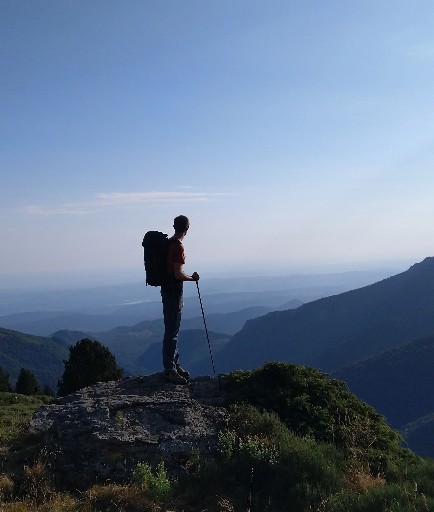

::: {.strip .header}
### About

*Biologist and algorithmic artist.*
:::

::: {.text-grid}

::: {.text-col}

### Bio

I have a scientific background in biology and have maintained an artistic practice since 2021. I live and work in Toulouse.

Currently, my scientific and artistic research coexist in a complementary manner, primarily sharing technical tools. I hope that the progressive convergence of these practices opens pathways toward original approaches to communicate the interdependencies of living systems.

#### Research - science

I am a biologist. I study how plants function, how they interact with each other and with their environment. I explore how community ecology and data science can help to design and grow more sustainable cropping systems.

#### Research - creation

I am interested in algorithmic art, using computer code as a creative medium^[Levin, G. (2021). Code As Creative Medium: A Handbook for Computational Art and Design. MIT Press.]. I use data visualization techniques, seeking the boundary between explanation and suggestion. Precise lines come easily from code and machines, i wonder how do we move from accuracy to expression. I readily adopt a systematic research approach to create images^[Molnar, V. (1984). Eloge de l’ordinateur (dans les arts visuels).].

### Selected exhibitions

::: {#list-exhibitions}
:::

:::

::: {.text-col}

### Contact

::: {.links .box}
email [pierre.casa@gmail.com](mailto:pierre.casa@gmail.com)

portfolio [[en](../../img/book_en.pdf) • [fr](../../img/book_fr.pdf)]{.link-pair}

code [github](https://github.com/picasa)

science [ORCID](https://orcid.org/0000-0001-7225-936X)
:::

:::

:::

