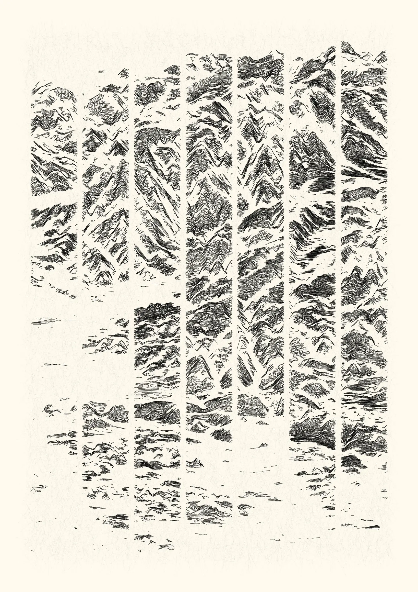
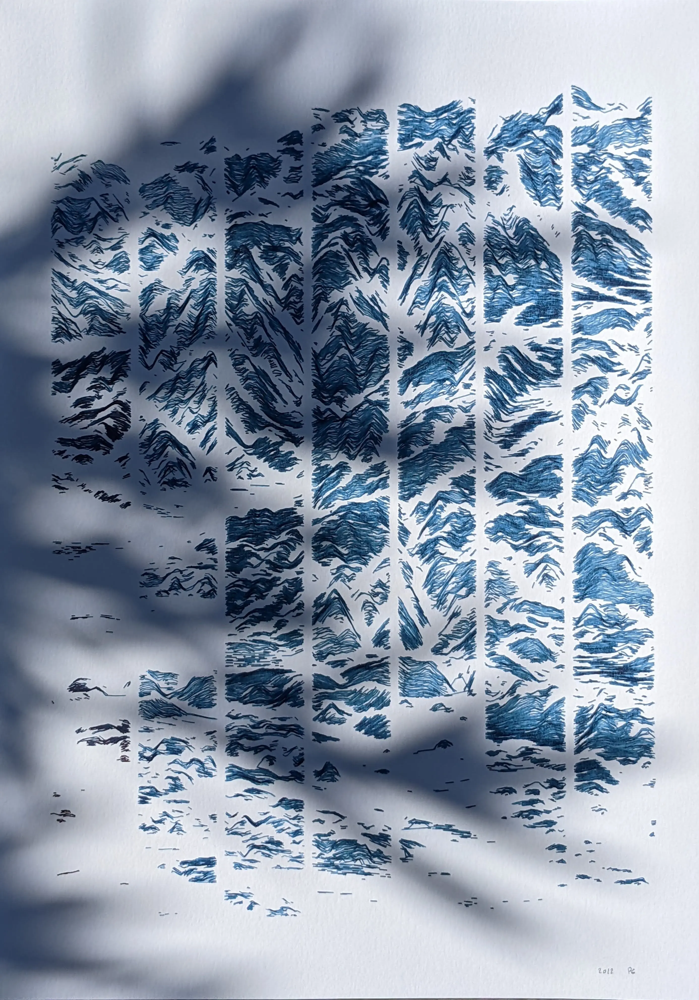

One work playing on the data-to-ink ratio idea from data visualisation — a way to say that you should avoid using too much ink if it does not represent information. In this case, a bit less than 2 percent of the initial topographical information is represented in this landscape.

This work (*Conflated Conflent*) was selected for an online collective exhibition ([*Arithmetic Phenomena*](https://verse.works/exhibitions/arithmetic-phenomena)).

* digital, 2338 x 3307 lossless bitmap, computed and rendered with R. Published as NFT on the verse platform ([link](https://verse.works/artworks/9d4ddfbf-5cb3-4b41-a0e5-229277d76bf6)).

{.lightbox width=33%}
{.lightbox width=33%}