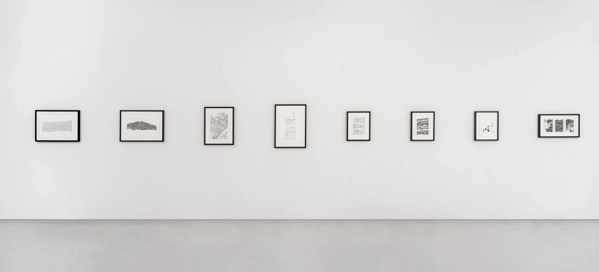

```{r}
#| include: false
source(here::here("R/0_functions_web.r"))
```

In this collection of eight landscape representations, I used real elevation data produced by various public institutes to create digital representations of the Pyrénées mountain range. I selected pieces moving from realism to abstraction while staying in the landscape figurative style, a way to acknowledge mountains as scientific and mystic places.



These works were selected and presented during a collective exhibition ([*Odysseys*](https://verse.works/exhibitions/odysseys-pierre-casadebaig)), curated by the [Verse](https://verse.works) platform, in January 2023, at [Cromwell Place](https://www.cromwellplace.com), London.

* 8 digital and physical works
  * digital, lossless bitmap, computed and rendered with R. Published as NFTs on the verse platform ([link](https://verse.works/series/dispyr-by-pierre-casadebaig-1)).
  * ink on paper, plotted with Axidraw V3/A3 on 220 g/m2 paper (various format) with Rotring Isograph pens, Pentel FL2B brush pen, Pilot Parallel pen.

::: {.asterism}
&#8258;
:::

::: {.column-body-inset .gallery-flow .three}
```{r}
#| echo: false
#| results: asis
make_gallery(full = "img/gallery/2023_01_verse", output = "md")
```
:::
