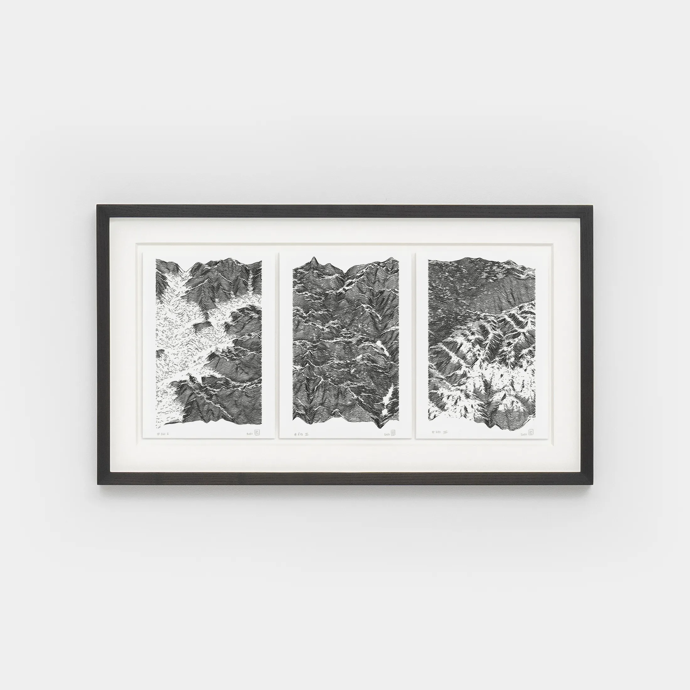

```{r}
#| include: false
source(here::here("R/0_functions_web.r"))
```

:::{.column-body}

::: {.strip .header}
### Works

*Code-generated drawings for pen plotter. Algorithmic series, exhibitions, and published releases.*
:::

A pen plotter works much like a human hand holding a pen or pencil. It is a two dimensional robotic arm with pen-holder, and this arm moves across the paper to draw lines - I'm using an AxiDraw model (A3/V3). The plotter receives instructions from a computer that drives the precise movements of the arm. These instructions (vector files) are the results produced by running a hopefully creative code.

{style="object-fit: cover; object-position: center; height: 450px; width: 100%;"}

## Series

::: {#list-series}
:::

## Exhibitions

::: {#list-exhibitions}
:::

## Releases

::: {#list-releases}
:::

## Miscellaneous

A selection digital works traced on paper. As if exploring the space defined by various parameters in the coding part was not enough, much is left to explore in the plotting process : different paper textures and colors, different pens (technical, felt, brush) and paint mediums (ink, acrylic).

:::

<br>

::: {.column-screen-inset .gallery-flow .four}
```{r}
#| echo: false
#| results: asis

make_gallery(full = "portfolio/img/gallery", output = "md", sort = "now")

```
::: 
