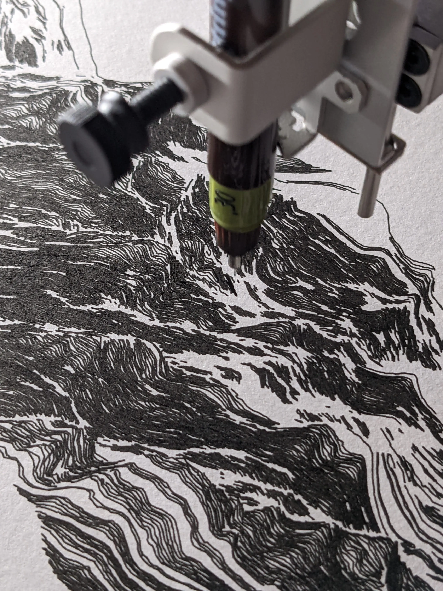
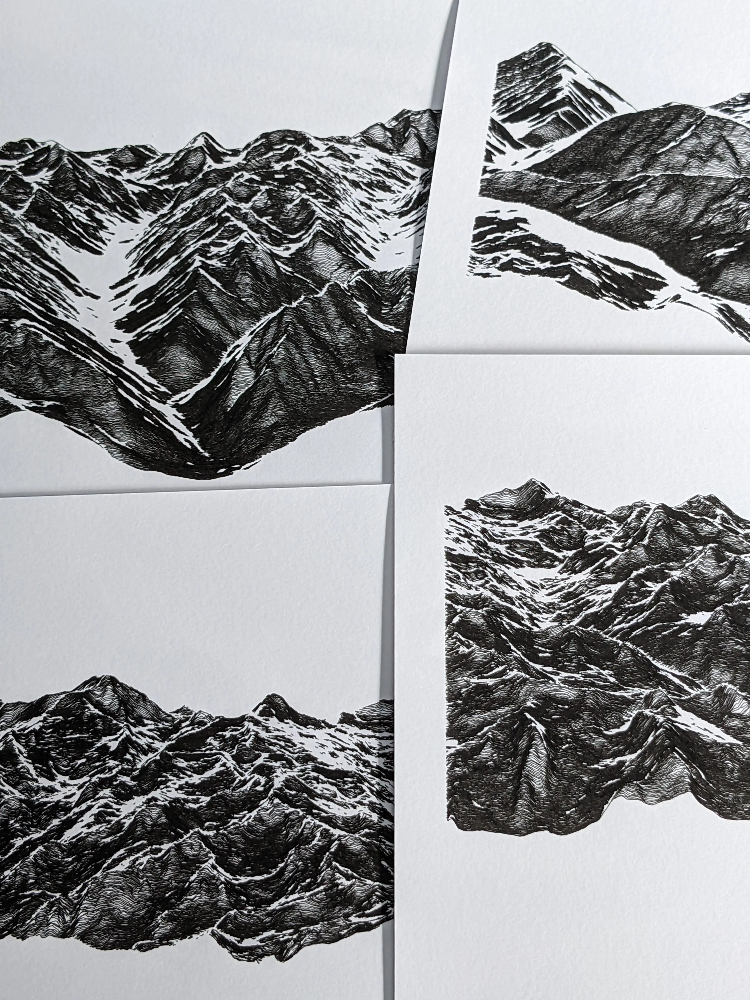
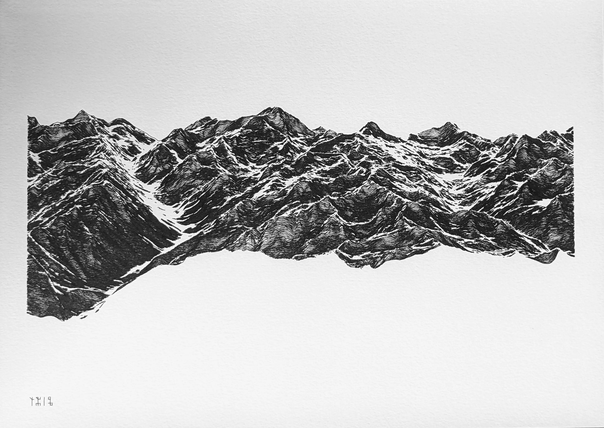

```{r}
#| include: false
source(here::here("R/0_functions_web.r"))
```

Selected fragments of the Pyrénées mountain range, based on real-world data from a digital elevation model (15x10 km region). The overall aesthetic is obtained by adding noise and discarding data as a function of a distance matrix.

::: {.column-body-inset .gallery-grid}
{.lightbox}

{.lightbox}

{.lightbox}
:::

* 8 digital and physical works
  * digital, 4960 x 3507 lossless bitmap, computed and rendered with R. Published as NFTs on the objkt platform ([link](https://objkt.com/explore/tokens/1?faContracts=KT1Aeoc32hMWkrLuej1WBwKNvwAWCqHPuFnr&sort=timestamp:desc)).
  * ink on paper, plotted with Axidraw V3/A3 on 300 g/m2 paper (298x420 mm, A3) with Rotring Isograph 0.3mm pen.

::: {.asterism}
&#8258;
:::

::: {.column-body-inset .gallery-grid}
```{r}
#| echo: false
#| results: asis
make_gallery(full = "img/gallery/2022_07_objkt", output = "md", pattern = "^(?!.*ridges)")
```
:::
