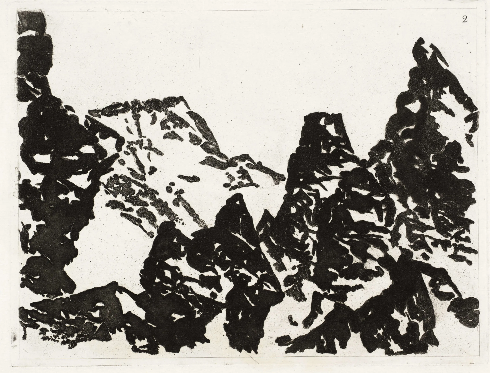
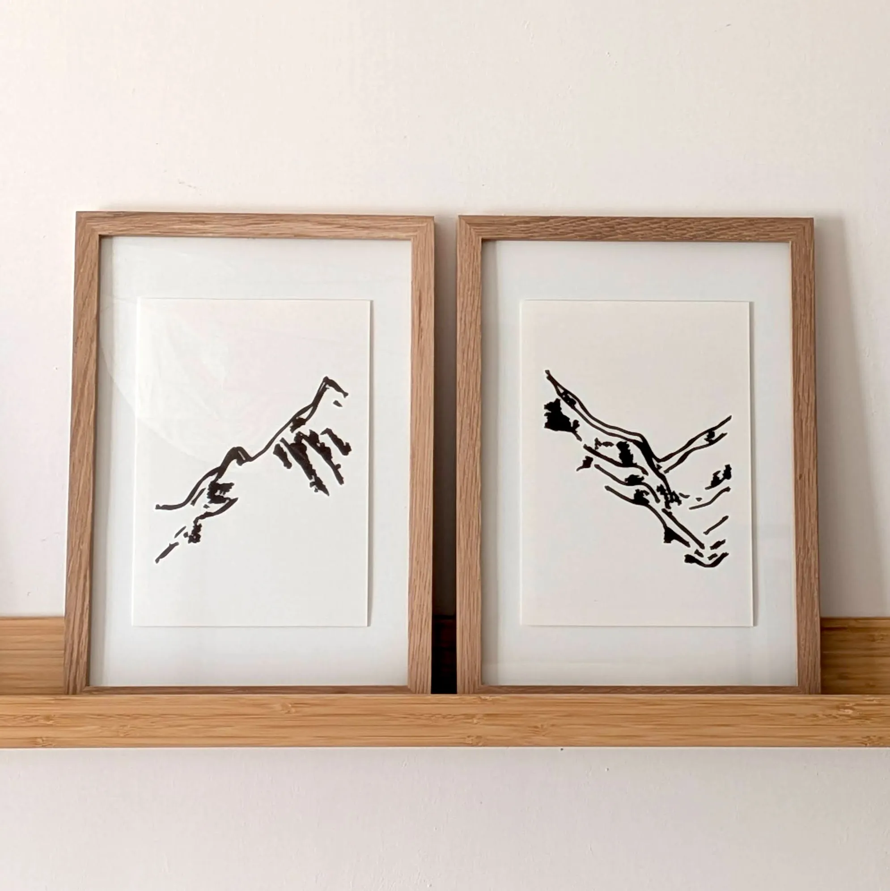
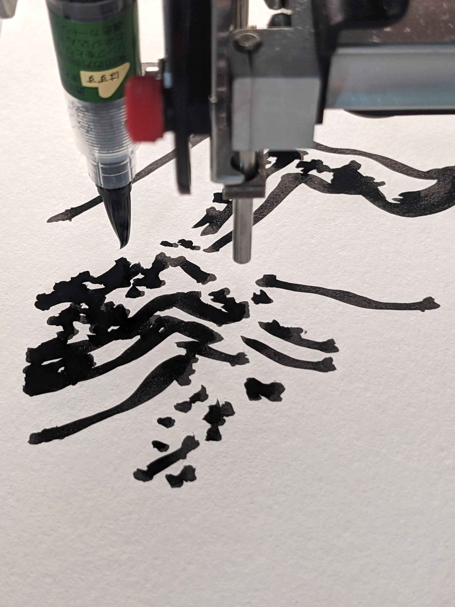
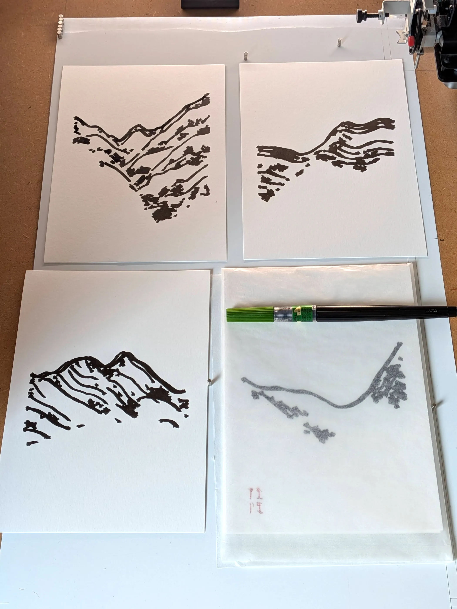
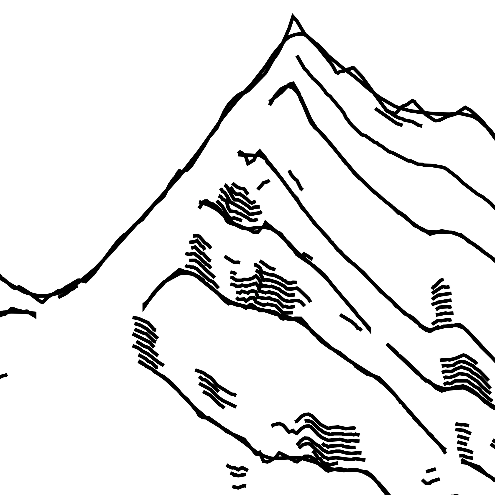
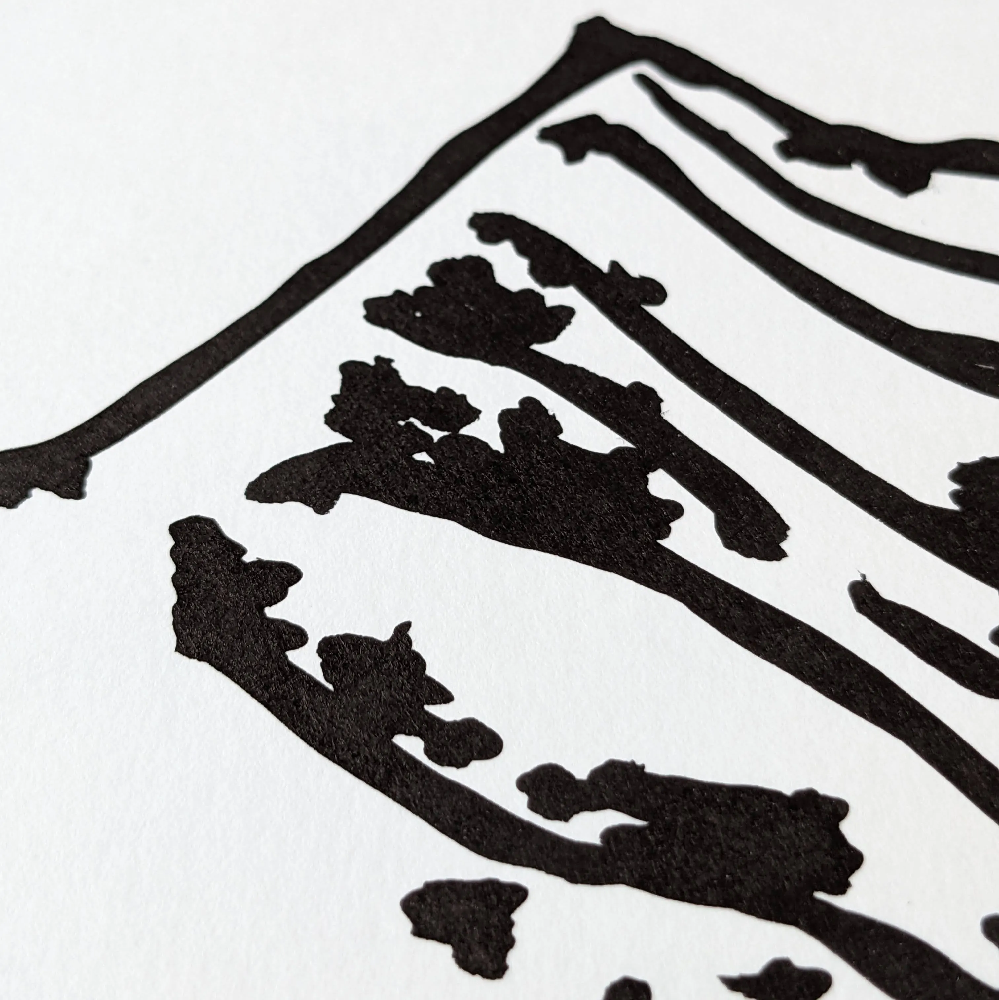

```{r}
#| label: setup
#| include: false
source(here::here("R/0_functions_web.r"))
```

This series explores alternatives to the usual modes of representing geographic information. By summarising this information to a few major lines, and by equipping the plotter with a brush, the resulting shapes can reach a higher level of abstraction. 

::: {.gallery-grid .small}
```{r}
#| label: preview
#| echo: false
#| results: asis

make_gallery(output = "md", max = 6)

```
::: 


::: {.asterism}
&#8258;
:::

## Inspiration and aims

While the style of Alexander Cozens landscapes was aligned with his era, his method shared similar properties as algorithmic art, for example when he qualified his starting point (a blot) as *a production of chance with a small degree of design*.



> [Alexander Cozens](https://en.wikipedia.org/wiki/Alexander_Cozens). Plate 2, "Blot" Landscapes from *A New Method of Assisting the Invention in Drawing Original Compositions of Landscape*, 1785

> Composing landscapes by invention, is not the art of imitating individual nature; it is more; it is forming artificial representations of landscape on the general principles of nature, founded in unity of character, which is true simplicity; concentring in each individual composition the beauties, which judicious imitation would select from those which are dispersed in nature. *Alexander Cozens* in *A New Method of Assisting the Invention in Drawing Original Compositions of Landscape*, 1785

The aim with this series was not to invent new landscapes, but to further simplify existing ones to the point where only essential shapes remain. This work explores two processes: the simplification of a mass of high-resolution data into a few lines and, because of this simplicity, the physical rendering leaning into calligraphy aesthetics.



> **Two iterations from the dispyr / loess algorithm.** 148 x 210 mm, ink on paper.

## Process

On the digital side, the processing is identical to the previous [*dispyr*](/posts/works/series/dispyr) algorithm, with parameters tuned to remove 90% of the initial dataset. One addition was to use a non-parametric smoothing method (loess) to give more weight and character to long lines. In the generated vector file, a new smooth line will be overlaid on the original jagged line to emulate a back-and-forth stroke with the brush.

At this point, emulating a brush aesthetic in digital outputs would mean coding for physics: how the lines are drawn irregularly due to the pen interaction with the paper texture (hard), or even how the ink is diffused as a function of the quantity deposited by a brush (much harder).  
Working on the physical aspect of this work felt more rewarding. While the brush movement is handled by the generated vector files, the brush tip height relative to the paper surface and the speed of brush up and down movement are machine parameters. While it seems natural when holding a brush in hand, it took a surprising amount of time to get those settings right on a machine. Those settings depended on the brush brand and size (softness), and on the movement speed. 

::: {.column-body-inset .gallery-grid .small}
<div> {.lightbox group="default"} </div>
<div> {.lightbox group="default"} </div>
<div> {.lightbox group="default"} </div>
:::

> **Tracing process and details.**

This is why using a drawing machine as the final step for this project was particularly interesting. 
On one hand, I get to avoid thinking about the necessary level of emulation of real-world materials in a digital context (skeuomorphism?). 
On the other, the interactions with this machine caused some interesting feedback at the code level. For example, when the machine traced the first lines, I noticed that the brush tip was lagging behind the machine movement, acting exactly as an analogue smoother function. In response, the code-level smoothing functions were updated to account for the physical process.

::: {.column-body-inset .gallery-grid .margin}
<div> {.lightbox group="default"} </div>
<div> {.lightbox group="default"} </div>
:::

> **From brush movement instructions to ink on paper.**
> The left image is the vector file; it represents the trajectory of the brush on the paper, with the exact same pressure along the strokes. The two-stroke smoothing process is visible in the top ridge. The right image is a picture of the traced result on paper. Both are a cropped version from the iteration #35. 

All the vector outputs from this series were traced on 200gsm paper (Canson mixed media, natural white, fine grain) with two pens: a Pentel brush (FL2B, black ink) for the ridges and a fountain pen (Lamy Joy 1.5 mm, Sailor Shikiori Yodaki red ink) for the red glyphs.
 

## Iterations

In the end, the outputs of this algorithm were used as a part of a larger series mixing different aesthetics ([*ridge regression*](/posts/works/series/ridge)). We generated 1024 iterations and manually curated the 56 presented here. 

<br>

::: {.column-screen-inset .gallery-grid .small}
```{r}
#| label: gallery
#| echo: false
#| results: asis

make_gallery(output = "md")

```
::: 


