```{r}
#| label: setup
#| include: false
source(here::here("R/0_functions_web.r"))
```

Ridge Regression is a series of imagined landscapes inspired by data visualization. It draws upon real elevation data to reveal the topography of France's diverse mountain ranges. Mimicking an evolutionary process applied to geology, it generates a variety of landscape elements that are selected and recombined to create new landforms.

::: {.gallery-grid .small}
```{r}
#| label: preview
#| echo: false
#| results: asis

make_gallery(output = "md", max = 6)

```
::: 


::: {.asterism}
&#8258;
:::

## Inspiration and aims

This work explores data-based landscape representations. The generated landscapes are neither real nor completely fictional, but created by a computational process from authentic data. 

The process again draws from Cozens leading ideas on imaginative landscapes (*A New Method of Assisting the Invention in Drawing Original Compositions of Landscape*, 1785), where he mentions concentrating elements otherwise "dispersed in nature". In a previous algorithm ([*dispyr*](/posts/works/series/dispyr)), each landscape was unequivocally linked to a piece of topographical data, and this project explores the combination of dispersed elements into an imaginative new landscapes.

::: {.column-body-inset .gallery-grid}
<div> 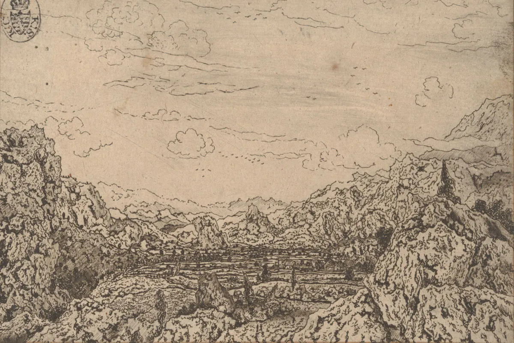{.lightbox group="default"} </div>
<div> 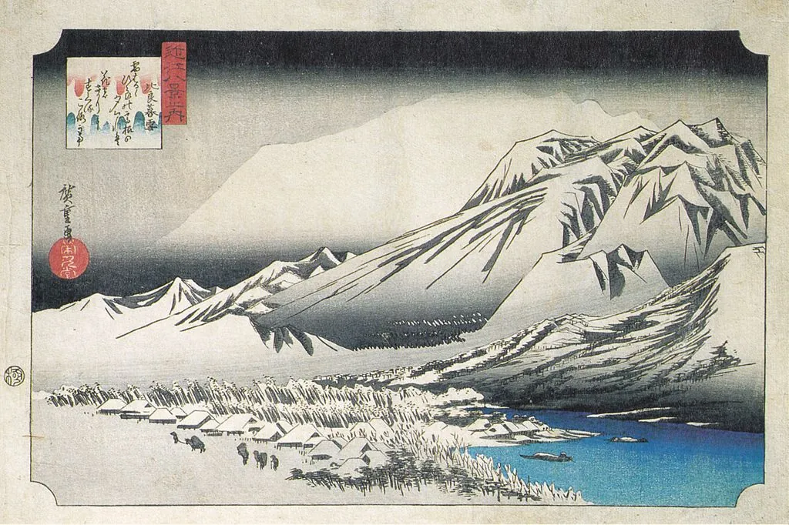{.lightbox group="default"} </div>
:::

> (left) *The Enclosed Valley*, [Hercules Segers](https://en.wikipedia.org/wiki/Hercules_Seghers), c. 1625 - c. 1630. Line etching and drypoint, printed in brown on paper prepared with a light brown ground. ([source](https://www.rijksmuseum.nl/en/collection/RP-P-H-OB-813/catalogue-entry?pdfView=False)).  
> (right) *Eight Views of Ōmi - Hira Mountains*, [Hiroshige](https://en.wikipedia.org/wiki/Hiroshige), 1820. Woodblock print ([source](https://en.wikipedia.org/wiki/File:Hiroshige_Omi_Hirai.webp))

At the aesthetic level, early landscape representations were also an inspiration, particularly etchings by Segers and Hiroshige the work, which both presented a form of simplification of the reality. The broad shadows in Hiroshige woodblocks were really interesting.

On the digital side, instead of striving for realistic renderings, the algorithm is fine-tuned to evoke hand-drawn landscapes. Most of the work was done on composition rules: how to combine individual ridges into a new landscape, how to layout these components on a page, as a function of their form.   

::: {.column-body-inset .gallery-grid .img-ax}
<div> 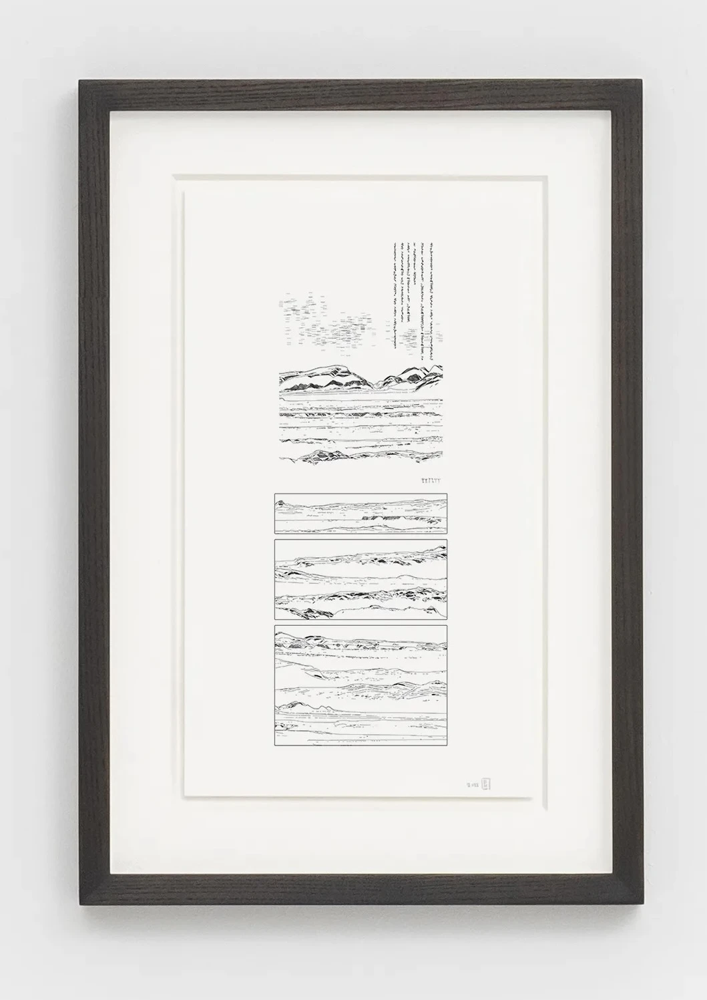{.lightbox group="default"} </div>
<div> 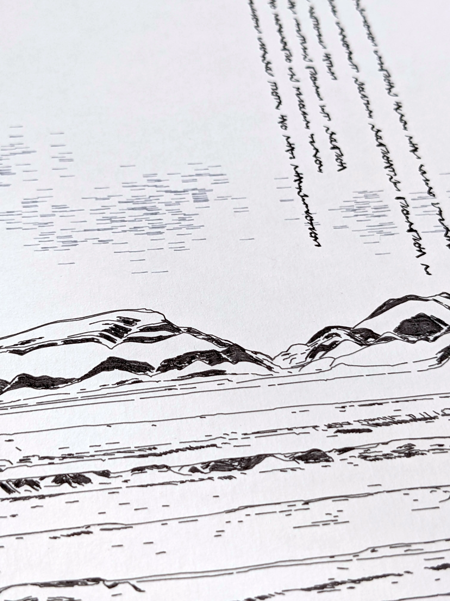{.lightbox group="default"} </div>
:::

> **One work from an early version of the ridge algorithm.**
> The global appearance was finalized but the selection and layout were not rule-based at this step, making this a unique work. 

## Process

### Generate a library of landscape elements

The initial step is to generate a collection of simplified landscape forms by repeatedly sampling a vast region through small "windows". We base the landscape topography on observed data, rather than data generated from mathematical functions. Specifically, we focus on the variations in land height in South-West France, encoded in a digital elevation model (DEM, here IGN [RGE Alti 5m](https://geoservices.ign.fr/rgealti#telechargement5m), 5x5 m cells).
The 3D data surrounding a given location (within a 3x3 km square) is transformed into a series of 2D lines, referred to as a landscape element. Adjustments to the [*dispyr*](/posts/works/series/dispyr) algorithm, allowed for a transition from a realistic depiction of topography to more simplified forms.

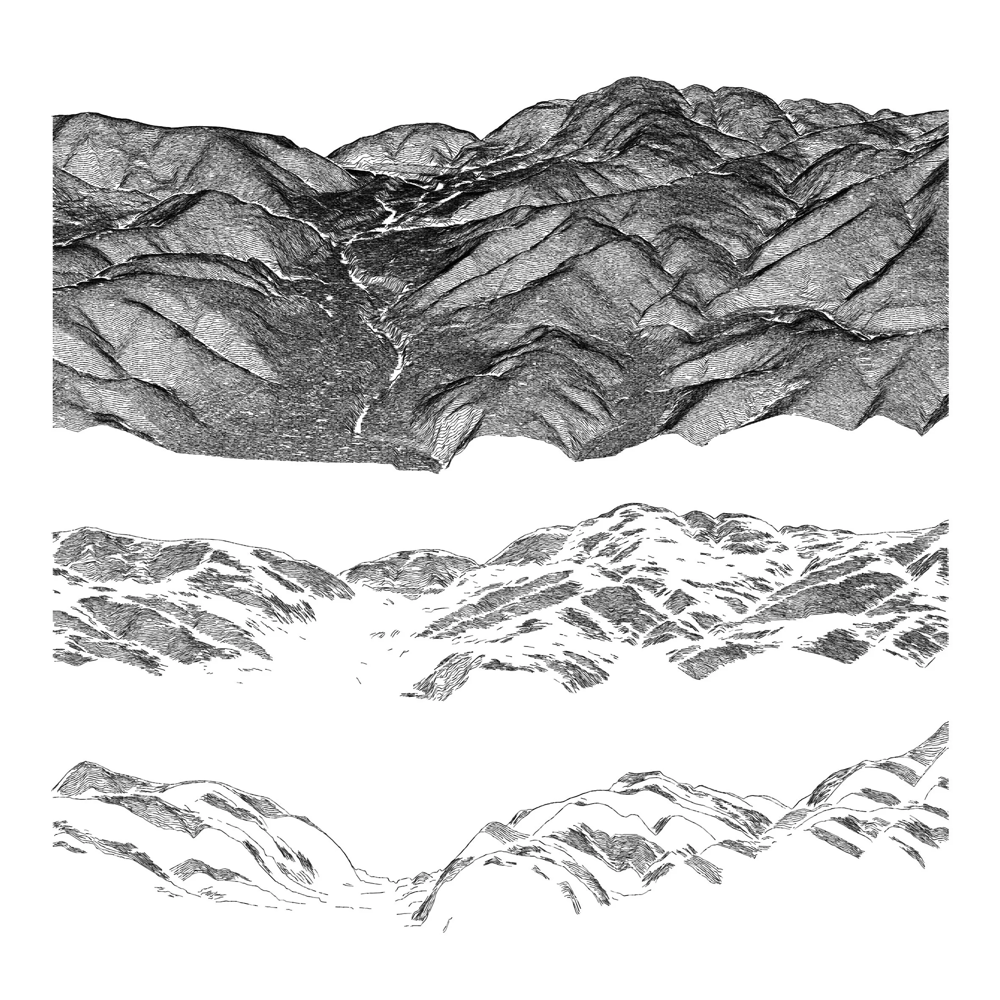

> **Navigating the parameter space to extract contours and forms.**
> The top image exhibits a high level of detail, keeping the complexity and features of the real terrain. 
> The middle image represents a shift towards abstraction while retaining recognizable elements of mountain landscapes. It simplifies details and textures, and alters the projection to create more empty space.
> The bottom image further abstracts the concept of mountain landscapes. This style uses minimal lines and shading to convey the idea of mountains, focusing on the silhouette and basic structure rather than detailed textures.

In each iteration, these landscape elements can depict anything from a single horizon to a series of layered ridges, depending on the data's sampling location and orientation—two variables introduced at random. I have chosen to work with a simulation set of approximately 3000 elements.

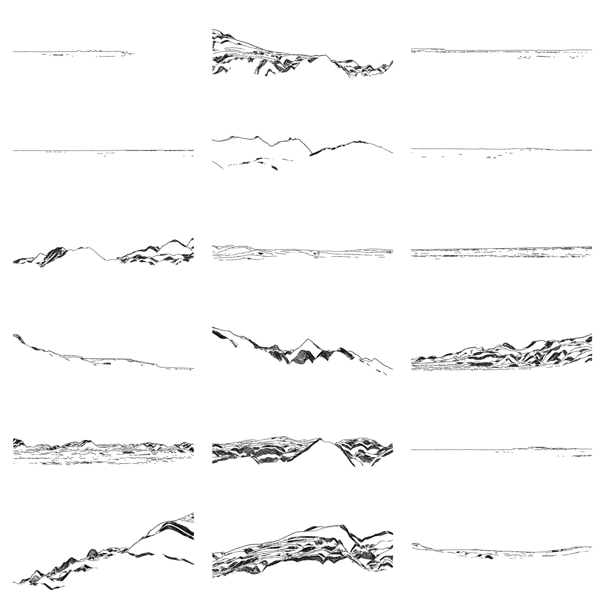

> **A random sample of the diversity in the population of generated landscape elements**
> The randomness in the sampling process is the only driver of the diversity observed in these generated landscape elements.

### Select contrasted building elements 

Although the library of simulated landscape elements contained a significant variety, some were bland, such as flat lines exhibiting minimal texture. Each element was characterized by a concise set of physical attributes, including its location, orientation, and elevation metrics (mean, deviation, range).

Initially, the plan was to leverage these features for automatic classification into various groups through unsupervised cluster analysis. However, the resultant groups proved to be too visually heterogeneous. A manual review of the library allowed to classify each element into either a *tall* or *flat* category, based on their resemblance to mountains or plains, respectively.

### Combine elements into new landscapes 

To craft an imaginary piece of landscape, we select a random mixture of $k$ elements from the two predefined sets: 1 from the tall set ($n_1 = 470$) and $k-1$ from the flat set ($n_2 = 480$). To enable landscapes with different aspect ratio, $k$ was varying between 3 and 12. The combinatorics are surprising, in this case the potential number of unique combinations is incredibly large ($n_1\times \binom{n_2}{k-1} \approx 1.6 \times 10^{21}$), albeit lower when ensuring than an element could only be used once (probably above billions, not sure how to estimate this number properly).  

Integrating multiple landscapes on a page introduced additional complexity as the construction could not be done independently. Also, to avoid too much regularity in the construction, each element was assigned a given probability to appear in the final landscape.
Technically, the construction algorithm starts by dividing each element set in equal-sized groups corresponding to the number of distinct landscapes to be assembled. Then, each element is assigned a probability to be featured or not in the assembly. The sampling step operates by groups, ensuring that each assembly features different elements.

Once the proper building elements are selected, they are simply layered one on top of the other, starting from elements with the smaller range in the y-axis. The distance between elements also decreases as a function of their rank. While this system gives pleasing results, we can imagine much more refinement in the building process (more element types, different assembly rules).


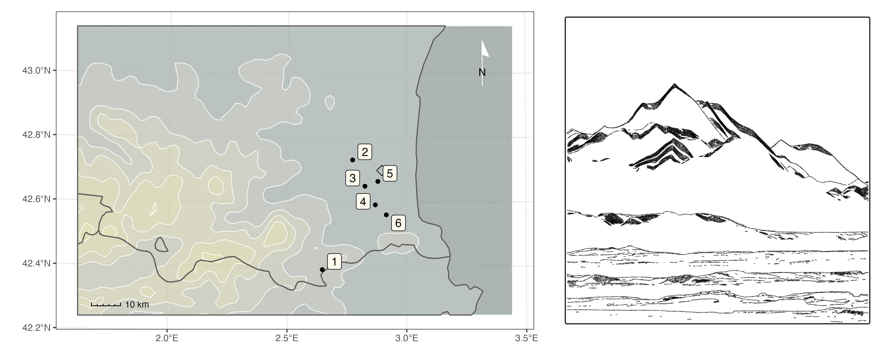

> **Sampling a set of independent locations to build an imaginary landscape.**
> We begin by selecting a random combination of landscape elements from a library. Although the selection is random, it adheres to a basic rule: a total of 3-12 elements, comprising one *tall* element and the remainder as *flat* elements. The composition of the landscape is determined by layering these elements according to their elevation range. The map on the left illustrates the geographical locations of the sampled terrain. The figure on the right depicts the resultant imaginary landscape, constructed using locations labeled in ascending order from top to bottom.


### Design distinct page layouts

While the created imaginative landscapes have nice aesthetics and conceptual properties, their diversity of shape is not sufficient to justify hundreds of outputs. Because of their diversity of aspect ratio, they were well suited to be organized into a grid system. With another algorithm able to generate writings and titles, it was tempting to aim for a series with graphic novel characteristics.

Each page of the series is divided into different sections, or "cells", by a generative grid system. This grid system partitions the page into up to three parts, with each part being a one-sixth multiple (e.g. 1/6, 2/6, 3/6, for the top left page in the figure). This method is first applied on the y-axis and yields 11 partitions: 1 full page, 3 2-partitions, and 7 3-partitions. The same system is applied to individual cells in a page, enabling x-axis splits. The sampling probabilities in the partitions list were adjusted to favor a moderately fragmented layouts.  

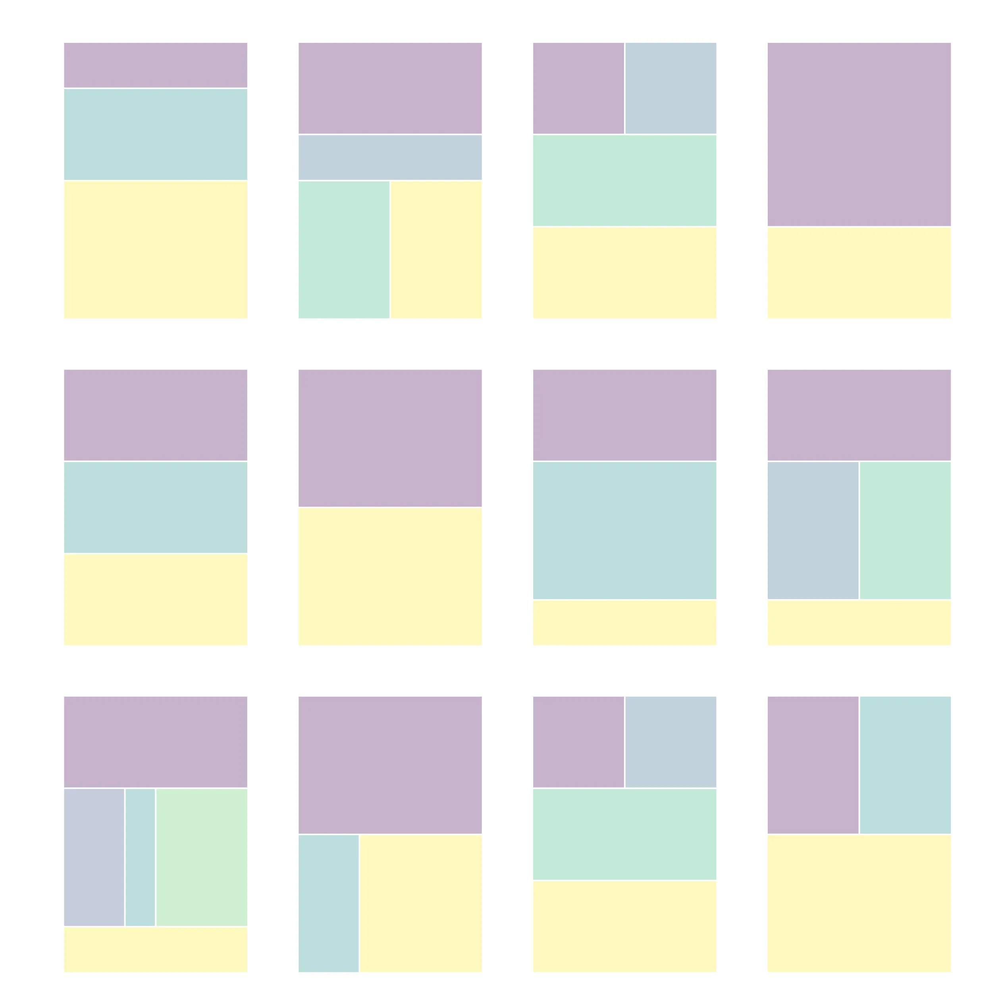

> **Twelve random illustrations from the modular grid system.**
> The page is randomly divided into up to three parts, with each part being a one-sixth multiple (e.g. 1/6, 2/6, 3/6, top left page). This partition is first applied on the y-axis of the page, and then on one or two  applied on the x-axis

We designed four page styles using both fixed layouts and this modular grid system: two full-page landscapes ([*brush*](/posts/works/series/brush) and *cloud*), and two grid layouts with (*figure*) or without legend (*partition*).
Three additional systems were used to complete the graphical novel aesthetic:

  1. clouds made from probabilistic stroke density (*cloud*)
  2. glyphs that encode either the geographical coordinates (*brush*, one region) or the value of the random seeds (*figure*, n regions)
  3. asemic text, used as a caption in the *figure* style.

::: {.column-body-inset .gallery-grid .small}
<div> 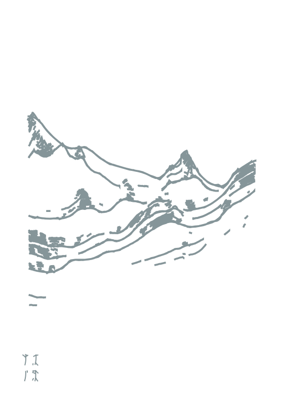{.lightbox group="default"} </div>
<div> 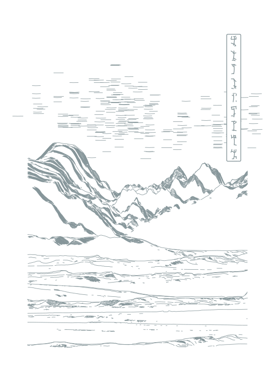{.lightbox group="default"} </div>
<div> 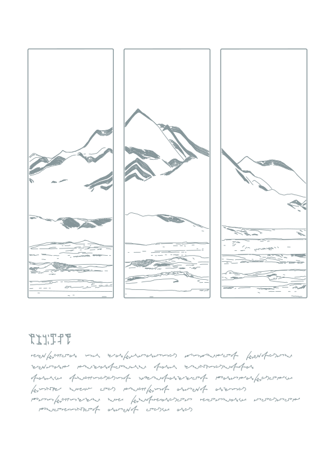{.lightbox group="default"} </div>
<div> 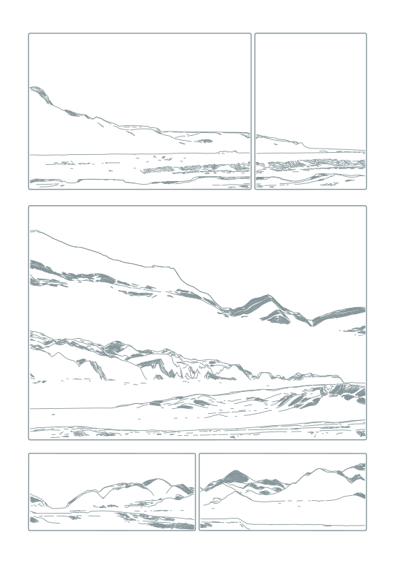{.lightbox group="default"} </div>
:::

> **An illustration of the four defined page styles.**
> From left to right, two full-page landscapes ([*brush*](/posts/works/series/brush) and *cloud*), and two grid layouts with (*figure*) or without legend (*partition*). These images are vector files (they only represent strokes), which is all the information needed to drive a drawing machine.


### Draw the digital works on paper

All the vector outputs from this series were traced on paper (Canson mixed media, natural white, fine grain, 200 gsm, 148 x 210 mm) with a different set of pens : 

* **brush pen** (Pentel FL2B, black ink): ridges in the *brush* design.
* **calligraphy fountain pen** (Lamy Joy 1.5 mm): glyphs in the *brush* design (Sailor Shikiori Yodaki red ink) and in the *cloud* design (Pilot Iroshizuku take-sumi neutral black ink). 
* **calligraphy pens** (Pilot Parallel): hatched cloud in the *cloud* design (3.8 mm, Pilot Iroshizuku fuyu-syogun medium gray ink), bold writings in the *figure* design (1.5 mm, Pilot black ink).
* **technical pens** (Rotring Isograph): ridges in the *cloud*, *figure*, and *grids* designs (0.3 mm), frames in the  *figure* and *grids* style (0.8 mm), and writings in the *figure* style (0.3 mm), all were drawn with the Pilot Iroshizuku take-sumi ink.

::: {.column-body-inset .gallery-grid}
<div> 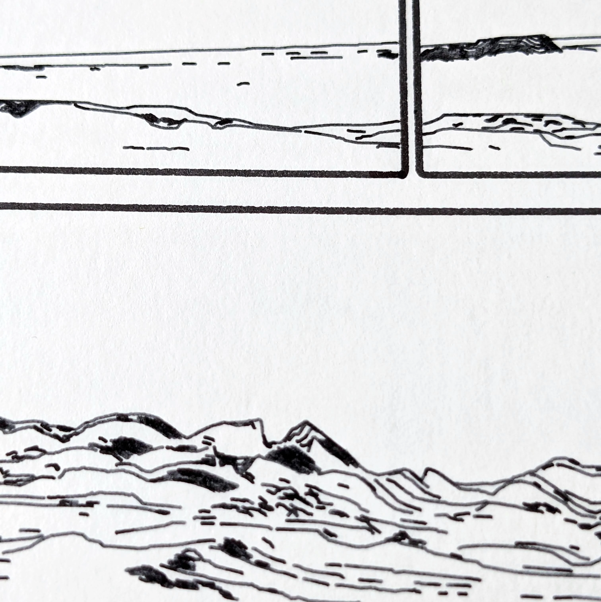{.lightbox group="default"} </div>
<div> 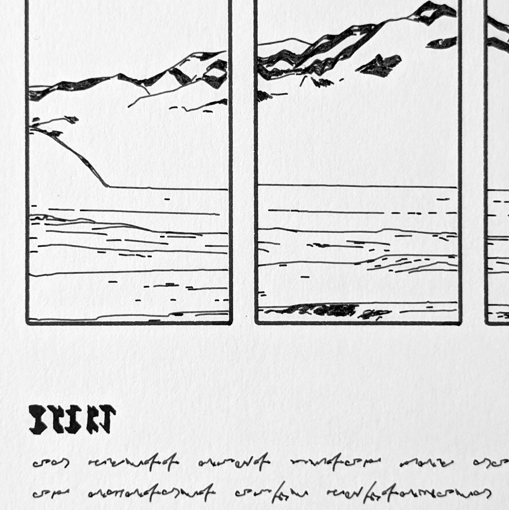{.lightbox group="default"} </div>
<div> 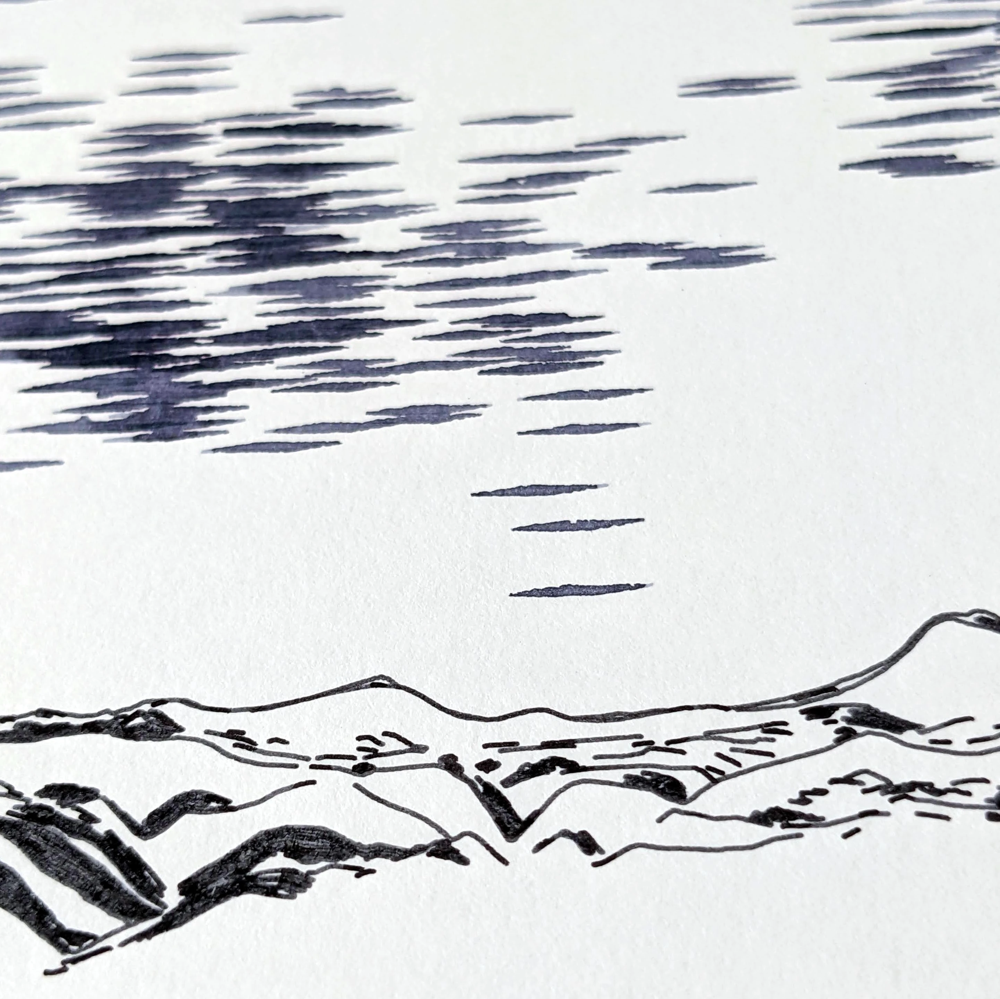{.lightbox group="default"} </div>
<div> 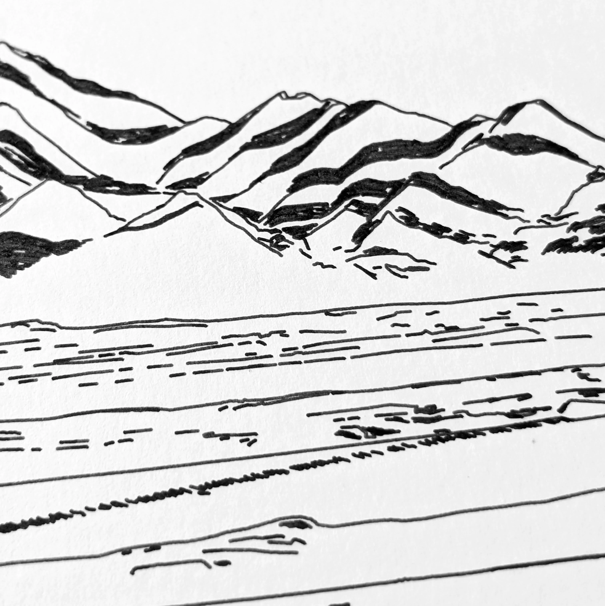{.lightbox group="default"} </div>
<div> 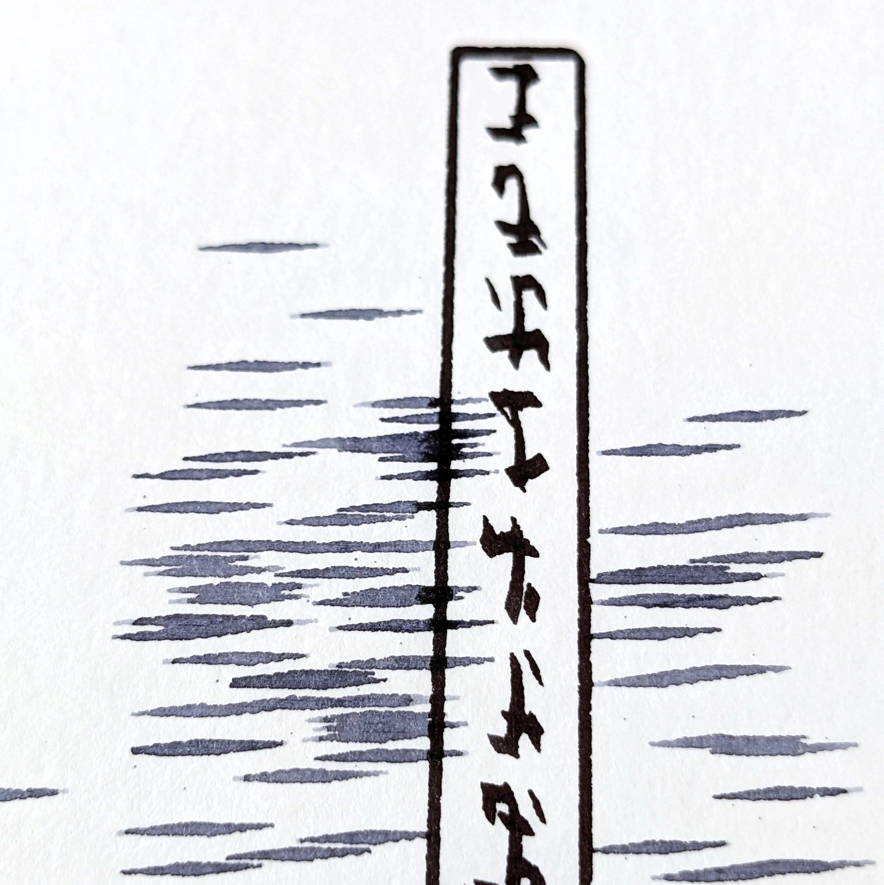{.lightbox group="default"} </div>
<div> 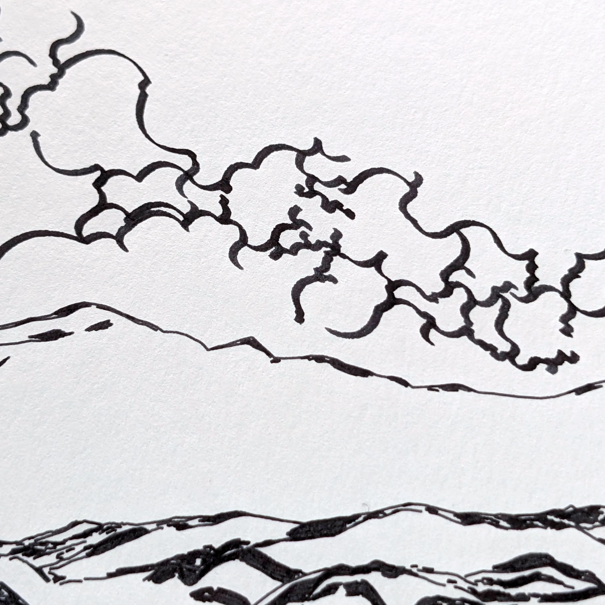{.lightbox group="default"} </div>
:::

> **Details from work-in-progress iterations.**
 

## Iterations

To view the algorithm output space, we generated 256 iterations per page style (1024 for the *brush* style).
The final series gathers 128 works, a manual selection of 72 iterations from the *ridge regression* algorithm and 56 iterations from the previous [*brush*](/posts/works/series/brush/) algorithm. 

So, none of these landscapes ever existed, and most of those which were generated were lost. At least, the ones traced on paper should have a longer existence than their digital twins.

<br>

::: {.column-screen-inset .gallery-grid .small}
```{r}
#| label: gallery
#| echo: false
#| results: asis

make_gallery(output = "md")

```
::: 


