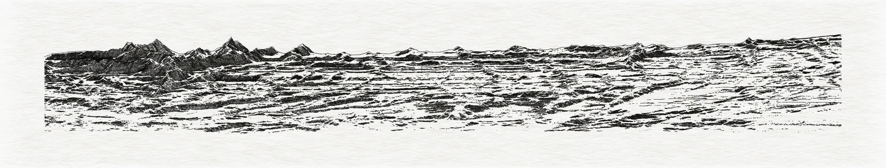
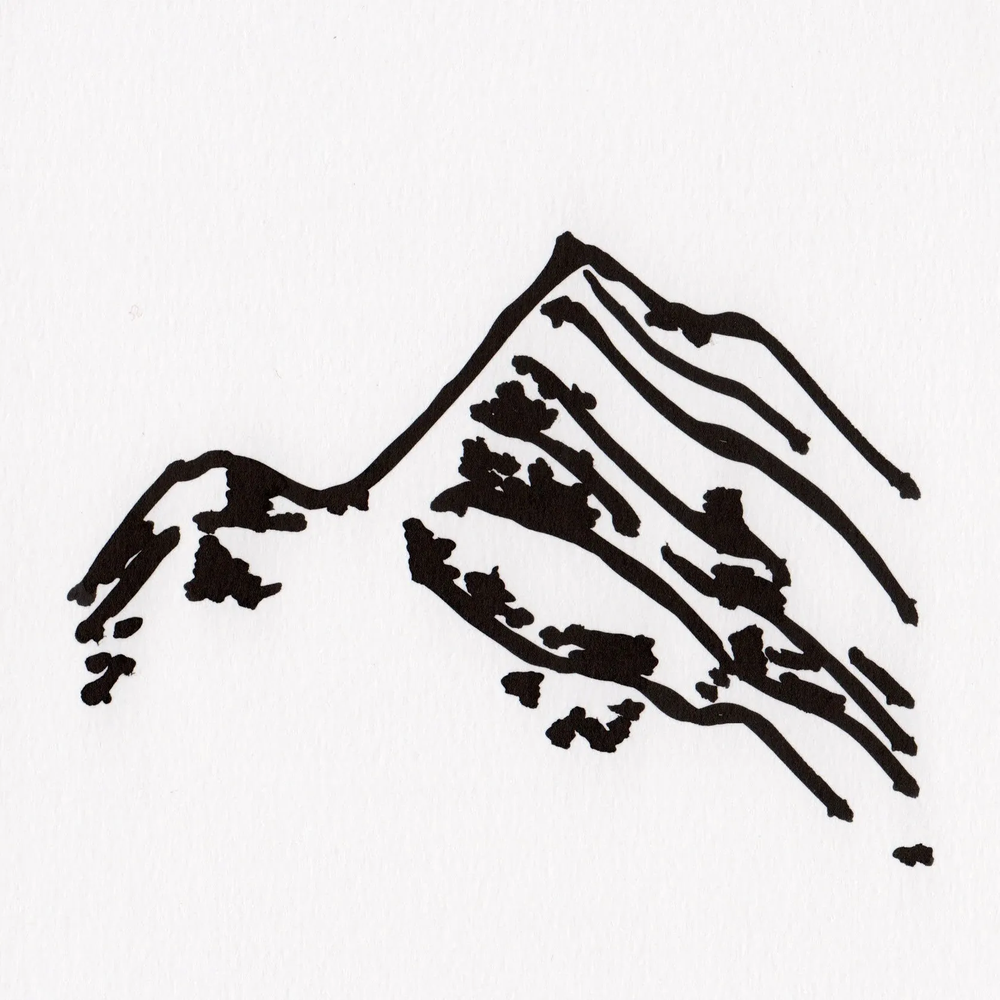
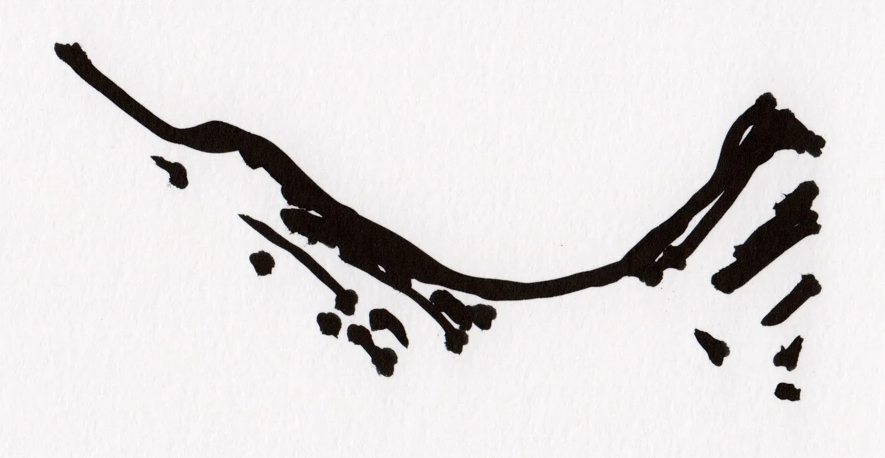

{.lightbox group="default"}

> I am using the [R](https://www.r-project.org/) programming language to write algorithms that generate digital images. The idea is to code a sequence of operations, balancing designed rules and randomness, that generates a new output each time it is executed by a computer. These outputs (vector images) are instructions to drive a pen plotter, like an artisanal method to draw those images on paper.
I often start from existing datasets, treating them as malleable materials to craft diverse visual representations. The whole process is very much like repurposing a tool originally made for statistical analysis and quantitative display of information for artistic endeavors.  
This site documents the ideas and processes underlying the functioning of the algorithms, but some examples are published on [](https://github.com/picasa/generative_examples).  

::: {.text-grid}

::: {.text-col}
Using a drawing machine fundamentally shapes my practice, as the plotter's constraints (drawing lines rather than pixels) create an ongoing negotiation between digital logic and physical rendering. Sometimes the machine's limitations simplify my approach (greater precision); other times they demand creative workarounds (fixed pen pressure). This dialogue between code and mechanical drawing is central to my work.

By generating hundreds or thousands of variations from the same algorithm, i explore what makes a form recognizable. Among a thousand generated mountains, why do some immediately read as mountains while others remain abstract marks? This multiplicity reveals something about essential qualities, not through averaging or reduction, but through experiencing the full range of possibility.

The rapid feedback loop between coding and visual outputs develops a particular kind of intuition, one that emerges from watching patterns unfold across many iterations. I expect this open-ended process to lead to unexpected connections between systems and representations. What mechanisms are at work when transforming topographical into calligraphic gestures ? How do we navigate between writing and drawing, between what we decode through reading versus what we apprehend through pure visual perception?
:::

::: {.text-col}
{.lightbox group="default"}

{.lightbox group="default"}

:::

:::  

